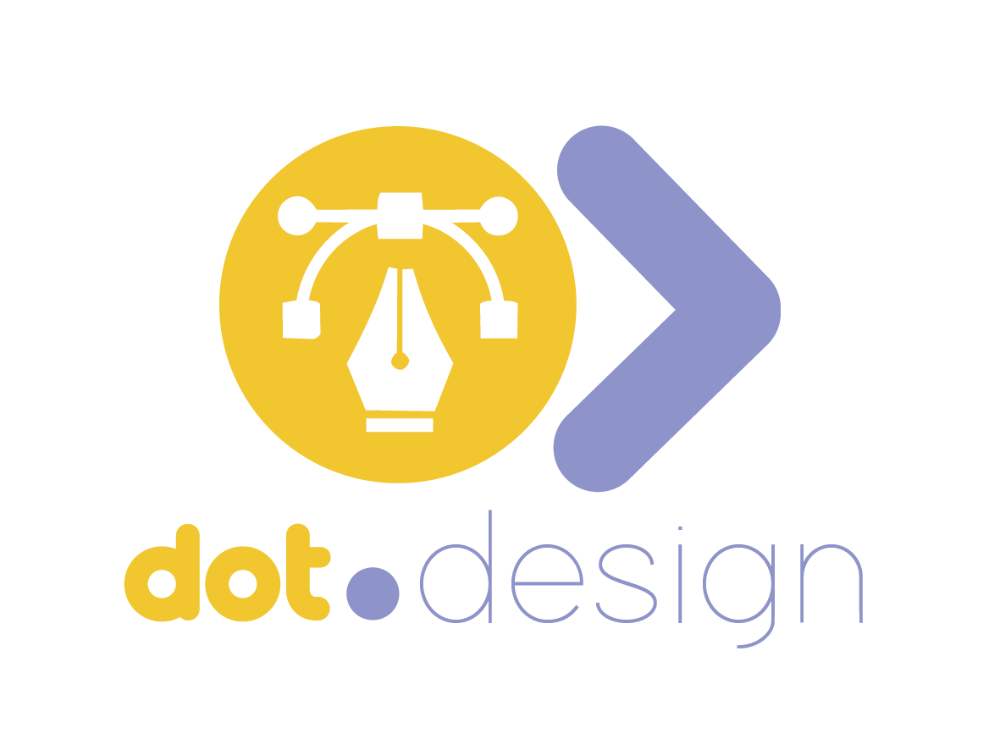

<div align="center">



<br /><br />

**The Dot Ecosystem's canvas-first AI design tool — plus a shared design-token / component-library scaffold.**

<br />

   

<br /><br />

**Part of the Dot Ecosystem** &nbsp;·&nbsp; see [Dot.Brain](https://github.com/sakhilebhayi/Dot.Brain) for the ecosystem knowledge map

</div>

---

## What is Dot.Design?

Dot.Design is the visual-creation platform in the Dot Ecosystem — a canvas-first editor paired with generative AI, aimed at producing on-brand graphics, social posts, and marketing collateral without requiring professional design skill. Users open a project, drop text/shapes/images/icons onto a canvas, optionally ask AI to generate imagery, and export the result.

**This repository currently holds two coexisting domains** (see `wiki.md` for the full detail and the open framing question this raises with Dot.Brain):

1. **Canvas / AI creation tool** — `DesignProject`, `DesignCanvas`, `DesignAsset`, `AiGenerationLog`. Per-user data. The interactive canvas editor UI itself is not yet built; the backend/data model exist ahead of the front end.
2. **Design-token / component-library scaffold** (`/design-system/*`) — `TokenSet`, `DesignToken`, `Component`, `TokenConsumptionRecord`. Deliberately global/shared (no per-user or per-team scoping), since a design system is one catalog every platform consumes.

## Core Features

- Canvas editor domain — drag-and-drop text, shapes, images, and icons (data model in place; interactive editor UI not yet built)
- AI image generation logging from text prompts, multi-provider (`AiGenerationLog.provider`: Anthropic, OpenAI, Stability, Replicate)
- Asset library — uploaded/generated files with type, size, and metadata
- Design-token / component catalog — versioned color/type/spacing/motion tokens, reusable component definitions, and a tracking table of which ecosystem platform consumes which token-set version
- Ecosystem SSO via Sanctum handoff token (`EcosystemAuthController`)

## Domain Models

**Canvas / AI tool:**
- **DesignProject** — canvas project with metadata (type, dimensions, unit)
- **DesignCanvas** — one or more pages per project, JSON `elements` blob
- **DesignAsset** — uploaded/generated files
- **AiGenerationLog** — one row per AI generation request

**Design-token / component-library scaffold:**
- **TokenSet** — a versioned group of tokens (e.g. "Core Palette")
- **DesignToken** — a single color/type/spacing/motion token
- **Component** — a reusable UI component definition
- **TokenConsumptionRecord** — which ecosystem platform consumes which token set, pinned to which version

## Tech Stack

| Layer | Technology |
|---|---|
| Framework | Laravel 12 |
| Language | PHP 8.4 |
| Frontend | Livewire 3 · Alpine.js 3 · Tailwind CSS |
| Database | PostgreSQL 16 (shared across the Dot Ecosystem) |
| Realtime | Laravel Reverb |
| Auth | Laravel Sanctum + Jetstream (teams, 2FA) |
| AI | Multi-provider: Anthropic, OpenAI, Stability, Replicate |
| Storage | AWS S3 / Local (Flysystem) |
| Search | Laravel Scout · Meilisearch (planned) |
| Queue | Redis · Laravel Horizon (planned) |

## Quick Start

```bash
git clone <this-repo-url> Dot.Design
cd Dot.Design
cp .env.example .env
composer install
npm install && npm run build
php artisan key:generate
php artisan migrate
php artisan db:seed
php artisan serve
```

> **Ecosystem SSO:** Set `DB_*` env vars to the shared Dot Ecosystem PostgreSQL instance. Users authenticated elsewhere in the ecosystem gain access automatically via Sanctum handoff tokens through `EcosystemAuthController`.

## Ecosystem

**Dot.Design** is one of roughly 20 platforms in the Dot Ecosystem, connected via shared PostgreSQL and Sanctum SSO, and unified by a shared knowledge repository, **Dot.Brain**. See `wiki.md` in this repo for Dot.Design's own account of what's implemented, and Dot.Brain's `platforms/dot-design.md` for the ecosystem-ingested view (currently a known, tracked mismatch — see `wiki.md` §1.1).

## License

MIT
